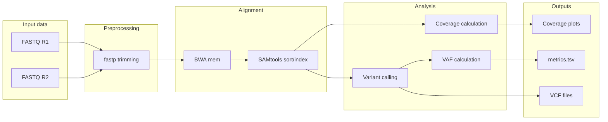
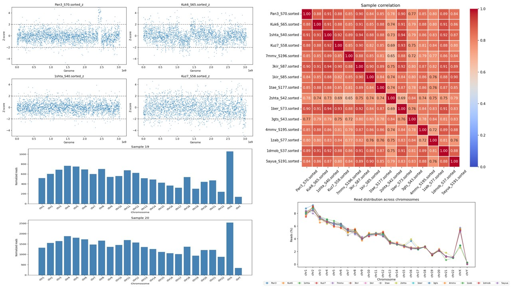

# LINE-SINE

Repetitive elements LINE and SINE are widely spread across human genome. Due to their high density and relatively uniform distribution, LINE/SINE elements can be used as anchor points for enrichment and subsequent targeted sequencing aimed at detecting large chromosomal abnormalities. This approach is particularly useful for identifying large genomic rearrangements, including deletions, duplications, and structural variants, because changes in copy number or chromosomal segment organization result in altered relative sequencing coverage.
This repository provides a pipeline for LINE/SINE-targeted sequencing data analysis: FASTQ preprocessing (fastp), alignment (BWA-MEM), BAM processing (samtools), coverage calculation (configurable bin size), variant calling (bcftools), VAF estimation, and visualization notebooks.

## Pipeline features

- FASTQ preprocessing
- Alignment with BWA
- BAM sorting/indexing
- Coverage calculation
- Variant calling
- VAF estimation



## Tools used

- `fastp` - trimming
- `bwa` - alignment
- `samtools` - BAM processing
- `bcftools` - variant calling
- Python visualization notebooks

## Features

- Automatic paired FASTQ detection
- Trimming with fastp
- Alignment using BWA-MEM
- BAM indexing
- Genome coverage calculation
- Variant calling
- VAF extraction
- Metrics summary  

## Requirements

### Python

Install Python dependencies:

```bash
pip install -r requirements.txt
```

## External tools

The following tools must be available:

- `fastp`
- `bwa`
- `samtools`
- `bcftools`

### Installation example (Ubuntu/Debian)

```bash
sudo apt install bwa samtools bcftools
```

### Install fastp

```bash
conda install -c bioconda fastp
```

---

## Input structure

Expected FASTQ naming:

```
sample_R1.fastq.gz
sample_R2.fastq.gz
```

### Example

```
data/
├── file1_R1.fastq.gz
├── file1_R2.fastq.gz
├── file2_R1.fastq.gz
└── file2_R2.fastq.gz
```

---

## Usage

```bash
python pipeline.py <input_dir> <reference.fa>
```

### Example

```bash
python pipeline.py data/ hg38.fa
```

---

## Output structure

```
output/
└── run_name/
    └── sample_id/
        ├── trim/
        ├── bam/
        ├── qc/
        └── plots/
```

---

## Generated files

- Trimmed FASTQ files  
- Sorted and indexed BAM files  
- VCF variant calls  
- Coverage metrics  
- Genome coverage plots  
- metrics.tsv summary  

---

## Coverage calculation

Coverage is computed using pileup bins:

```
coverage = reads_in_bin / bin_size
```

Default bin size: **1,000,000 bp** (you can change it)

---

## Variant calling

Variants are called using:

- bcftools mpileup  
- bcftools call  

VAF is computed from AD (allele depth) fields.

---

## Visualization

Run notebooks in order:

1. metrics
2. coverage analysis
3. z-score analysis
4. correlation heatmap
5. examples


---

## Output metrics - metrics.tsv

The pipeline generates a summary table:

| sample | metric       | value |
|--------|-------------|-------|
| S1     | mean_cov    | 18.42 |
| S1     | mean_vaf    | 0.37  |
| S1     | n_variants  | 1240  |
| S2     | mean_cov    | 21.10 |
| S2     | mean_vaf    | 0.41  |
| S2     | n_variants  | 980   |

---

## Example workflow

```bash
python pipeline.py data/ reference.fa
jupyter notebook notebooks/visualization.ipynb
```