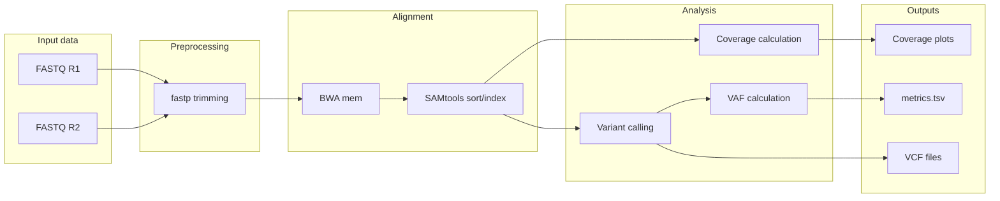

# LINE-SINE

Repetitive elements LINE and SINE are widely spread across human genome and can serve as "anchors" for targeted sequencing. For targeted LINE enrichment only single primer set can be used that significantly simplifies enrichment process. Target sequencing can be used to detect large genomic alterations (CNV, LOH > 10 Mb).

## Pipeline features

- FASTQ preprocessing
- Alignment with BWA
- BAM sorting/indexing
- Coverage calculation
- Variant calling
- VAF estimation

## Configurable parameters

Pipeline supports runtime configuration via Config class:

bwa_threads — number of threads for BWA alignment (default: 6)  
samtools_threads — number of threads for BAM processing (default: 4)  
bin_size — genome bin size for coverage calculation (default: 1,000,000 bp)  
min_mapping_quality — minimum mapping quality filter (default: 20)  
fastp_quality_phred — FASTP quality threshold (default: 20)  
fastp_length_required — minimum read length after trimming (default: 30)  

## Tools used

fastp - trimming  
bwa - alignment  
samtools - BAM processing  
bcftools - variant calling  
Python visualization notebooks  

## Features

- Automatic paired FASTQ detection  
- Configurable runtime parameters via config object  
- Multi-core alignment support  
- BAM indexing  
- Adjustable coverage binning  
- Variant calling  
- VAF extraction  
- Metrics summary  

## Requirements

### Python

Install dependencies:

pip install -r requirements.txt  

## External tools

The following tools must be installed:

fastp  
bwa  
samtools  
bcftools  

### Installation (Ubuntu/Debian)

sudo apt install bwa samtools bcftools  

### Install fastp

conda install -c bioconda fastp  

## Input structure

Expected FASTQ naming:

sample_R1.fastq.gz  
sample_R2.fastq.gz  

Example dataset:

data/  
├── file1_R1.fastq.gz  
├── file1_R2.fastq.gz  
├── file2_R1.fastq.gz  
└── file2_R2.fastq.gz  

## Usage

python pipeline.py <input_dir> <reference.fa>  

### Example:

python pipeline.py data/ hg38.fa  

### Example with config:

from config import Config  
from pipeline import Pipeline  

config = Config(  
bwa_threads=8,  
samtools_threads=6,  
bin_size=500_000,  
min_mapping_quality=30  
)  

Pipeline("data/", "hg38.fa", config=config).run()  

## Output structure

output/  
└── run_name/  
    └── sample_id/  
        ├── trim/  
        ├── bam/  
        ├── qc/  
        └── plots/  

## Generated files

- Trimmed FASTQ files  
- Sorted and indexed BAM files  
- VCF variant calls  
- Coverage metrics (bin-size dependent)  
- Genome coverage plots  
- metrics.tsv summary  

## Coverage calculation

Coverage is computed using fixed genomic bins:

coverage = reads_in_bin / bin_size  

Default bin size is 1,000,000 bp but can be changed via Config.bin_size.  

## Variant calling

Variants are called using:

- bcftools mpileup  
- bcftools call  

VAF is computed from AD (allele depth) fields.  

## Visualization

Run notebooks in order:

1. metrics  
2. coverage analysis  
3. z-score analysis  
4. correlation heatmap  
5. examples  

## Output metrics (metrics.tsv)

sample  metric      value  
S1      mean_cov    18.42  
S1      mean_vaf    0.37  
S1      n_variants  1240  
S2      mean_cov    21.10  
S2      mean_vaf    0.41  
S2      n_variants  980  

## Example workflow

python pipeline.py data/ reference.fa  
jupyter notebook notebooks/visualization.ipynb  